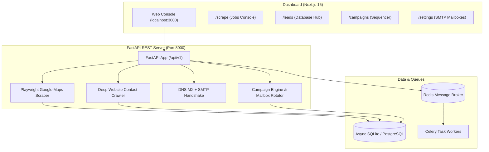

# LeadForge 🚀
### Autonomous Lead Generation & Cold Outreach Platform

[](https://opensource.org/licenses/MIT)
[](https://www.python.org/)
[](https://fastapi.tiangolo.com/)
[](https://nextjs.org/)
[](https://tailwindcss.com/)
[](https://www.docker.com/)
[](https://github.com/Aryanban/leadforge/pulls)

**LeadForge** is an open-source, full-stack, autonomous lead prospecting and automated cold email outreach platform. It combines **zero-cost Google Maps scraping**, **deep website email enrichment**, **SMTP deliverability verification**, and **multi-mailbox campaign automation** into a clean, modern SaaS dashboard.

Zero subscriptions, zero per-lead API costs, and 100% self-hosted on your machine or cloud server.

---

## ✨ Features at a Glance

| Module | What It Does | Why It's Powerful |
| :--- | :--- | :--- |
| 🗺️ **Google Maps Scraper** | Autonomous Playwright crawler for any location & industry | Stealth anti-detection, user-agent rotation, zero proxy fees needed |
| 🔍 **Website Contact Enricher** | Crawls `/contact`, `/about`, `/team` pages of target businesses | Discovers unlisted corporate emails, direct phone lines, WhatsApp & socials |
| 🛡️ **Zero-Cost Email Verifier** | DNS MX record resolution + direct SMTP RCPT TO handshake | Replaces paid verification APIs (ZeroBounce, Hunter) for ₹0 |
| 📬 **Multi-Mailbox Sender** | Rotates across Gmail, Zoho, Outlook, Amazon SES & SMTP | Distributes email volume across accounts to maximize deliverability |
| 📊 **Campaign Studio** | Dynamic template personalization (`{{business_name}}`, `{{city}}`) | 1x1 open tracking pixel, 1-click unsubscribe header (RFC 8058 compliant) |
| ⚡ **Modern Web Dashboard** | Next.js 15 + Tailwind CSS + Lucide Icons | Clean, responsive, fast UI with 1-click CSV/Excel export |

---

## ⚡ Quick Start (Instant Run on Mac / Linux / Windows)

LeadForge supports a zero-configuration local mode using asynchronous SQLite:

```bash
# 1. Clone the repository
git clone https://github.com/Aryanban/leadforge.git
cd leadforge

# 2. Run the 1-click launcher
./start.sh
```

**What `./start.sh` does automatically**:
1. Creates Python virtual environment (`.venv`) and installs dependencies.
2. Installs headless Chromium for Google Maps scraping via Playwright.
3. Seeds initial demo leads and sample cold outreach campaigns.
4. Starts the **FastAPI Backend** on [`http://localhost:8000`](http://localhost:8000) (Swagger Docs at [`/docs`](http://localhost:8000/docs)).
5. Starts the **Next.js Dashboard** on [`http://localhost:3000`](http://localhost:3000).

---

## 🐳 Cloud / Production Deployment (Docker Compose)

For cloud VPS deployment (AWS, GCP, DigitalOcean, Hetzner) with PostgreSQL, Redis, and Celery background workers:

```bash
# 1. Copy environment template
cp .env.example .env

# 2. Build and launch all container services
docker compose up -d --build
```

### Services Started:
- **`dashboard`**: Next.js 15 Web UI (`http://localhost:3000`)
- **`backend`**: FastAPI REST API (`http://localhost:8000`)
- **`celery-worker`**: Distributed scraping and enrichment background queue
- **`postgres`**: PostgreSQL 15 database (`5432`)
- **`redis`**: Redis 7 message broker (`6379`)

---

## 🏗️ System Architecture



---

## 🚀 Step-by-Step Usage Guide

### 1. Scrape Leads from Google Maps
1. Open the dashboard at `http://localhost:3000/scrape`.
2. Enter any search query (e.g., *"Property Dealers in Rohini Delhi"*, *"Marketing Agencies in Austin TX"*, *"Clinics in Mumbai"*).
3. Select the number of leads to extract (10, 20, 50, 100).
4. Click **Start Scraping**.
5. LeadForge launches an automated headless browser with humanized cursor movements, extracts company names, phone numbers, ratings, addresses, and websites, and automatically saves them with deduplication.

### 2. Auto-Enrich Missing Emails
1. Visit `http://localhost:3000/leads`.
2. Click **Auto-Enrich Missing Emails** (or enrich individual leads).
3. The crawler visits target websites, navigates `/contact`, `/about`, and `/team` pages, extracts emails and WhatsApp numbers, verifies their DNS records, and saves the verified contacts.

### 3. Connect Sender Mailboxes (SMTP)
1. Go to `http://localhost:3000/settings`.
2. Click **Add Mailbox**.
3. Select a preset (Gmail, Zoho, Outlook, Amazon SES, SendGrid) or custom SMTP.
   - *For Gmail*: Enter your Gmail and a 16-character **Google App Password**.
4. Click **Test Connection** to verify live authentication with the mail server.

### 4. Build & Launch Personalized Campaigns
1. Go to `http://localhost:3000/campaigns`.
2. Click **New Campaign**.
3. Use dynamic merge tags in subject and body:
   - `{{business_name}}` — e.g. *Balaji Properties*
   - `{{first_name}}` — e.g. *Rajesh*
   - `{{city}}` — e.g. *Delhi NCR*
   - `{{phone}}` — e.g. *+91 98112 34567*
   - `{{category}}` — e.g. *Real Estate Agency*
4. Click **Preview Rendered Copy** to verify personalized emails before sending.
5. Click **Launch**. LeadForge rotates between active mailboxes, spaces emails with jitter delays (15s), embeds open tracking pixels, and adds RFC-compliant unsubscribe links.

### 5. Export to Excel / CSV
Click **Export CSV** at any time on the Leads Hub to download a spreadsheet with verified emails, phones, and WhatsApp chat links.

---

## 🤖 AI Agent & Model Context Protocol (MCP) Integration

LeadForge is **AI-Agent native**. You can connect it directly to **Google Antigravity**, **Claude Desktop**, or **Cursor** to let an AI assistant autonomously search Google Maps, find corporate contacts across the open web, and sequence cold outreach directly from conversational prompts.

### 1. Using with Antigravity / Claude Desktop (MCP)
Add to your `mcp_config.json` (or `claude_desktop_config.json`):

```json
{
  "mcpServers": {
    "leadforge": {
      "command": "/path/to/leadforge/.venv/bin/python",
      "args": ["-m", "app.mcp_server"],
      "cwd": "/path/to/leadforge/backend"
    }
  }
}
```

#### Available MCP Tools:
- **`leadforge_scrape`**: Real-time Google Maps scraper with auto open web contact discovery (Yahoo/Bing/directories). Returns hyperlinked maps listings and deliverable emails.
- **`leadforge_search_leads`**: Search and filter local leads by category, keyword, or email status.
- **`leadforge_enrich_lead`**: Triggers deep web contact search and SMTP verification on any business.
- **`leadforge_create_campaign`**: Sets up multi-step cold email sequences.
- **`leadforge_get_stats`**: Overview metrics of leads, verified contacts, and campaigns.

### 2. Direct CLI Bridge
Run lead operations directly from the command line:

```bash
# Scrape leads with real-time web discovery & format as GitHub Markdown
python -m app.cli scrape "Real Estate Agents in Rohini Delhi" --limit 10 --format markdown

# Search database with filters
python -m app.cli search --query "Properties" --has-email --format markdown

# Deep search / enrich a specific business ID
python -m app.cli enrich 18

# Overview stats
python -m app.cli stats
```

---

## 📡 REST API Reference

The FastAPI backend provides auto-generated OpenAPI documentation accessible at [`http://localhost:8000/docs`](http://localhost:8000/docs).

| Method | Endpoint | Description |
| :--- | :--- | :--- |
| `GET` | `/health` | Server health and database connectivity status |
| `GET` | `/api/v1/analytics/stats` | Dashboard statistics (leads, verified counts, open rates) |
| `POST` | `/api/v1/scraper/start` | Trigger a Google Maps scrape job (`query`, `max_results`) |
| `GET` | `/api/v1/scraper/jobs` | List background scraping jobs and completion statuses |
| `GET` | `/api/v1/leads/` | Filterable, paginated lead directory (`search`, `industry`, `has_email`) |
| `POST` | `/api/v1/leads/` | Add a lead manually |
| `POST` | `/api/v1/enricher/lead/{id}` | Deep crawl website for emails & WhatsApp numbers |
| `POST` | `/api/v1/campaigns/` | Create a new outreach sequence |
| `POST` | `/api/v1/campaigns/{id}/start` | Launch campaign with mailbox rotation |
| `GET` | `/api/v1/campaigns/track/open/{id}` | Transparent 1x1 GIF open tracking pixel |
| `GET` | `/api/v1/campaigns/unsubscribe/{id}` | 1-click RFC-compliant unsubscribe endpoint |

---

## 🔒 Deliverability & Compliance Best Practices

- **Rate-Limiting & Jitter**: Default delay of 15 seconds between emails to protect IP reputation.
- **Unsubscribe Compliance**: Every email includes a `List-Unsubscribe` header and opt-out link. Unsubscribed leads are automatically blocked from future sends.
- **Open Tracking**: Zero-redirect 1x1 transparent GIF tracking pixel.

---

## 🤝 Contributing

Contributions are welcome! Whether it's reporting bugs, adding new scrapers (LinkedIn, Yelp, YellowPages), or improving deliverability algorithms:

1. Fork the Project (`https://github.com/Aryanban/leadforge/fork`)
2. Create your Feature Branch (`git checkout -b feature/AmazingFeature`)
3. Commit your Changes (`git commit -m 'feat: Add LinkedIn Company Scraper'`)
4. Push to the Branch (`git push origin feature/AmazingFeature`)
5. Open a Pull Request

---

## 📄 License

Distributed under the **MIT License**. See [`LICENSE`](./LICENSE) for more information.

Developed with ❤️ by [Aryan Bansal](https://github.com/Aryanban).
