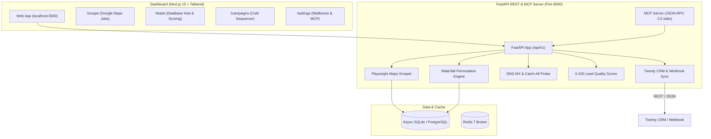

# LeadForge 🚀
### Autonomous Open-Source Lead Scraping, Apollo-Grade Waterfall Enrichment & Cold Outreach Platform

[](https://github.com/Aryanban/leadforge)
[](https://opensource.org/licenses/MIT)
[](https://www.python.org/)
[](https://fastapi.tiangolo.com/)
[](https://nextjs.org/)
[](https://modelcontextprotocol.io/)
[](https://twenty.com/)
[](https://www.docker.com/)
[](https://github.com/Aryanban/leadforge/pulls)

**LeadForge** is an open-source, full-stack lead generation, waterfall contact enrichment, and cold email outreach platform. It combines **zero-cost Google Maps scraping**, **Apollo-grade email permutations**, **catch-all server probing**, **0–100 AI lead scoring**, and **Twenty CRM synchronization** into a blazing fast Next.js 15 dashboard and native MCP server.

**Zero subscriptions. Zero per-lead API costs. 100% self-hosted.**

---

## 💡 Why LeadForge? (Cost & Feature Comparison)

| Feature | **LeadForge** | **Apollo.io** | **Hunter.io** | **Outscraper** |
| :--- | :---: | :---: | :---: | :---: |
| **Monthly Cost** | **$0 / Free Forever** | $99 / mo | $49 / mo | ~$50 / 10k leads |
| **Lead Limits** | **Unlimited** | 1,000 credits/mo | 500 searches/mo | Pay-per-record |
| **Self-Hosted / Private Data** | **Yes (100% Local / Self-Hosted)** | No (SaaS Cloud) | No (SaaS Cloud) | No (SaaS Cloud) |
| **Google Maps Scraping** | **Built-in (Playwright stealth)** | Extra add-on | Not included | API only |
| **GPS Coordinates (Lat/Lng)** | **Yes (Exact)** | Partial | No | Yes |
| **Unclaimed GBP Detection** | **Yes (High-Value Agency Angle)** | No | No | No |
| **Apollo-Style Email Permutations** | **Yes (`first.last@`, `first@`, etc.)** | Proprietary | Paid Add-on | No |
| **Catch-All Mail Server Probe** | **Yes (SMTP 250/550)** | Paid | Yes | No |
| **Automated Lead Scoring (0–100)** | **Yes (🔥 Hot / ⚡ Warm / ❄️ Cold)** | Custom filters only | No | No |
| **AI Agent Native (MCP Server)** | **Yes (Claude, Cursor, Antigravity)** | No | No | No |
| **Open-Source CRM Integration** | **Twenty CRM & Webhooks** | HubSpot / SF only | Zapier only | Webhooks only |
| **Cold Email Sequencer** | **Built-in with Mailbox Rotation** | Included | Included | No (Scraper only) |

---

## ✨ Core Superpowers

### 1. 🗺️ High-Star Google Maps Scraper
- **Anti-Detection Crawling**: Humanized mouse scrolls, randomized user agents, and resilient fallback mechanisms.
- **Precision Coordinate Parsing**: Extracts exact `latitude` and `longitude` from map endpoints.
- **Unclaimed Google Business Profile Detection**: Flags businesses where *"Claim this business"* is present — the #1 easiest prospecting hook for digital marketing, web design, and SEO agencies.
- **Rich Business Metadata**: Operational status ("Open", "Temporarily Closed"), price tier (`₹`, `$$`), review counts, ratings, and direct hyperlinked Google Maps URLs.

### 2. ⚡ Apollo-Grade Waterfall Email Enrichment
- **Corporate Email Permutation Engine**: Generates high-yield executive permutations (`{first}.{last}@{domain}`, `{first}@{domain}`, `{first_initial}{last}@{domain}`) plus standard corporate role aliases (`contact@`, `info@`, `sales@`, `office@`).
- **Catch-All Mail Server Detection**: Probes remote mail exchangers with randomized non-existent addresses. If the server accepts all emails (`250 OK`), it flags catch-all behavior to protect your sender reputation.
- **Zero-Cost SMTP Verification**: Performs direct DNS MX lookups and low-latency RCPT TO handshakes without paying 3rd-party verification APIs.
- **Multi-Source Fallback Crawling**: Discovers missing websites and phones across Yahoo, Bing, and web directories when Maps listings lack contact details.

### 3. 🔥 Automated AI Lead Scoring (0–100)
Every prospective business is evaluated and scored in real time:
- **🔥 HOT (Score 75–100)**: Verified deliverable email, WhatsApp-ready phone, active website, top ratings ($\ge 4.5$), high reviews.
- **⚡ WARM (Score 45–74)**: Phone number and website available; email unverified or missing.
- **❄️ COLD (Score <45)**: Limited contact data available.
- **Lead Badges**: Tagged with `Verified Email`, `WhatsApp Ready`, `Top Rated`, `Active Website`, and `Unclaimed GBP`.

### 4. 🔄 Twenty CRM & Zapier Webhook Sync
- **1-Click Twenty CRM Export**: Download standard `companies` and `people` schema JSON ready for [Twenty CRM](https://twenty.com/) import.
- **Automated Webhook Push**: Enter any webhook URL (Zapier, Make, n8n, Twenty CRM API) to sync enriched lead batches with one click.
- **Clean CSV / Excel Export**: Full spreadsheet export including coordinates, claimed status, and lead scores.

### 5. 🤖 AI Agent & MCP (Model Context Protocol) Native
LeadForge can be directly controlled by AI coding assistants like **Google Antigravity**, **Claude Code**, **Cursor**, or **Windsurf**.
- AI agents can call `leadforge_scrape`, `leadforge_search_leads`, `leadforge_enrich_lead`, and `leadforge_create_campaign` directly from natural language prompts.
- Fast CLI bridge: `python -m app.cli scrape "Clinics in Delhi" --format markdown`.

### 6. 📬 Built-in Cold Email Sequencer & Mailbox Rotation
- **Multi-Mailbox Rotation**: Connect Gmail, Zoho, Outlook, Amazon SES, or custom SMTP servers.
- **Personalized Merge Tags**: `{{business_name}}`, `{{first_name}}`, `{{city}}`, `{{phone}}`, `{{category}}`.
- **RFC 8058 1-Click Unsubscribe & Open Tracking**: 1x1 invisible tracking pixel with automatic suppression lists.

---

## ⚡ Quick Start (Instant Run)

### Prerequisites
- Python 3.10+
- Node.js 18+
- npm or yarn

```bash
# 1. Clone the repository
git clone https://github.com/Aryanban/leadforge.git
cd leadforge

# 2. Run the 1-click launcher
./start.sh
```

**What `./start.sh` does automatically**:
1. Creates Python virtual environment (`.venv`) and installs all dependencies.
2. Installs headless Chromium for Playwright scraping.
3. Initializes database with initial leads and templates.
4. Launches the **FastAPI Backend** on [`http://localhost:8000`](http://localhost:8000) ([Swagger API Docs](http://localhost:8000/docs)).
5. Launches the **Next.js 15 Dashboard** on [`http://localhost:3000`](http://localhost:3000).

---

## 🐳 Docker Deployment

Run all services (Next.js dashboard, FastAPI backend, Celery workers, PostgreSQL, and Redis) with Docker Compose:

```bash
cp .env.example .env
docker compose up -d --build
```

---

## 🏗️ System Architecture



---

## 🤖 MCP Server & AI Agent Setup

To empower your AI agent (Google Antigravity, Claude Desktop, Cursor) with LeadForge tools, add this configuration:

### Antigravity / Claude Desktop (`mcp_config.json`):
```json
{
  "mcpServers": {
    "leadforge": {
      "command": "/absolute/path/to/leadforge/.venv/bin/python",
      "args": ["-m", "app.mcp_server"],
      "cwd": "/absolute/path/to/leadforge/backend"
    }
  }
}
```

### Direct CLI Usage:
```bash
# Scrape leads & output as GitHub markdown
python -m app.cli scrape "Dentists in Miami FL" --limit 10 --format markdown

# Search database by keyword
python -m app.cli search --query "Dental" --format markdown

# Enrich specific business with waterfall permutations
python -m app.cli enrich 32

# View real-time database stats
python -m app.cli stats
```

---

## 🌟 Community & Star Milestones

If LeadForge saved you from expensive subscriptions, please consider giving us a star! ⭐

- **100 Stars**: 🏢 LinkedIn Company & Employee Scraper module.
- **500 Stars**: 🧠 Local AI Icebreaker & Copy Generator via Ollama / Groq.
- **1,000 Stars**: 📲 Automated WhatsApp Web Outreach & Follow-up Bot.

---

## 🤝 Contributing

We love contributions!
1. Fork the repo (`https://github.com/Aryanban/leadforge/fork`).
2. Create your feature branch (`git checkout -b feature/AmazingFeature`).
3. Commit your changes (`git commit -m 'feat: Add Yelp scraper'`).
4. Push to the branch (`git push origin feature/AmazingFeature`).
5. Open a Pull Request.

---

## 📄 License

Distributed under the **MIT License**. See [`LICENSE`](./LICENSE) for more information.

Maintained with ❤️ by [Aryan Bansal](https://github.com/Aryanban).
